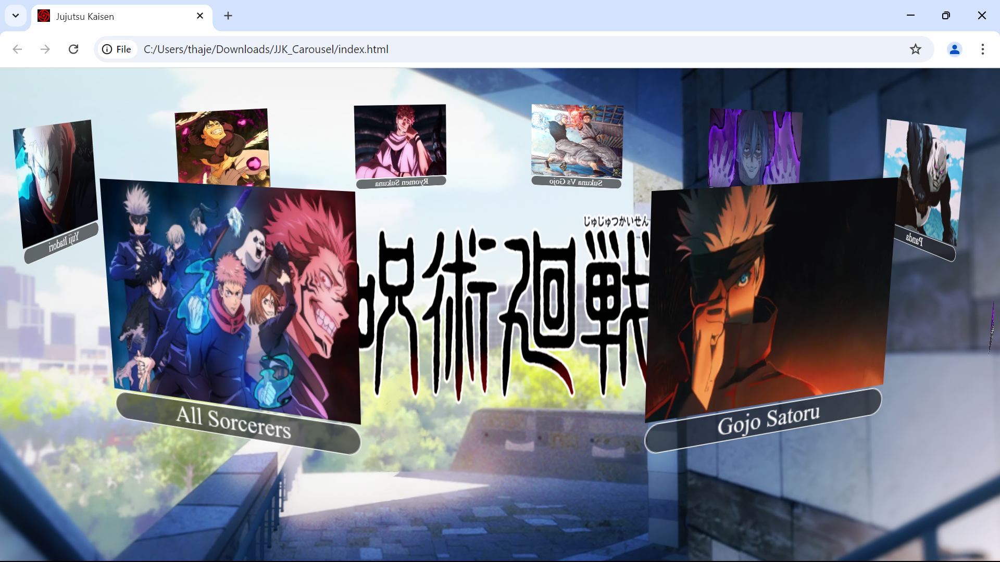

# JJK Carousel
A project I did for fun using images of characters from the anime Jujutsu Kaisen.
I might change this in the future, and instead of having just characters, change the images to fights and have them take the user(s) to a YouTube video of the fight scene from the anime.

## [Link to the product](https://thajeepan-rathiharan.github.io/JJK_-Carousel/)

## Screenshot:
- Screenshot of the project.

## Coding languages used:
- HTML
- CSS